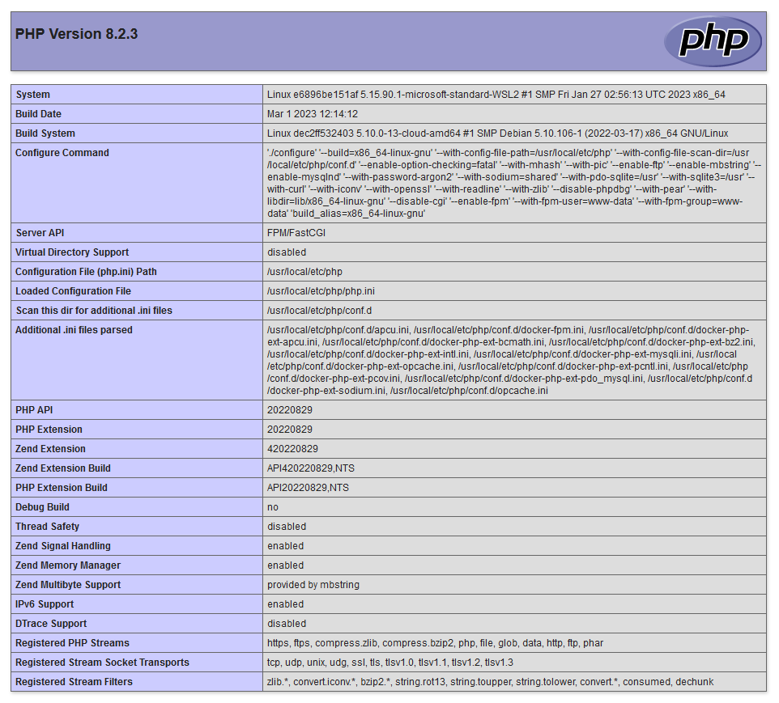

# template-docker-php

1. [About project](#about-project)
1. [Set up project](#set-up-project)
    * [Prerequisites](#prerequisites)
    * [Installation](#installation)
    * [Execute project](#execute-project)
1. [Additional information](#additional-information)
1. [Future improvements](#future-improvements)
1. [License](#license)

## About project
- [x] Docker with [PHP 8.1](https://www.php.net/supported-versions.php) container and [Symfony Local Web Server](https://symfony.com/doc/current/setup/symfony_server.html)
- [x] [Makefile](https://www.gnu.org/software/make/manual/make.html#Introduction) wit docker commands
- [x] [GitHub Actions](https://github.com/features/actions) to automate, customize, and execute your software development workflows right in your repository, including CI/CD
- [x] MIT License

## Set up project

### Prerequisites
- [Docker & Docker Compose](https://docs.docker.com/compose/install/)
- [Make](https://www.gnu.org/software/make/): windows users go [here](http://gnuwin32.sourceforge.net/packages/make.htm)

### Installation

Clone repository and move inside:

    git clone https://github.com/burus86/template-docker-php.git

    cd template-docker-php

Build and up docker containers:

    make start

### Execute project

Open in your favorite web browser the website [http://localhost:8080/](http://localhost:8080/).

## Additional information

Stop docker containers:

    make stop

Access bash for docker container:

    make bash

Show logs for docker container:

    make logs

## Future improvements

- [x] **[Upgrade PHP](https://www.php.net/supported-versions.php)** to latest stable version: 8.1
- [ ] Add database container: MySQL or PostgreSQL

## License
This project is licensed under the MIT License - see the [LICENSE](LICENSE) file for details.
